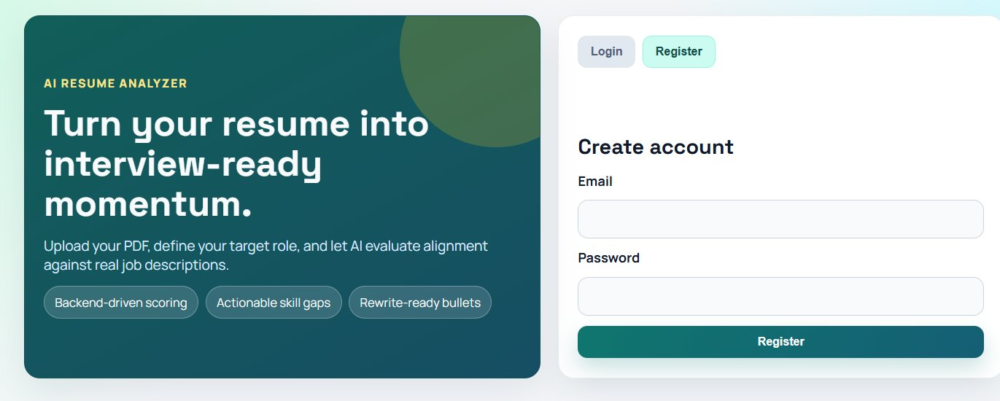
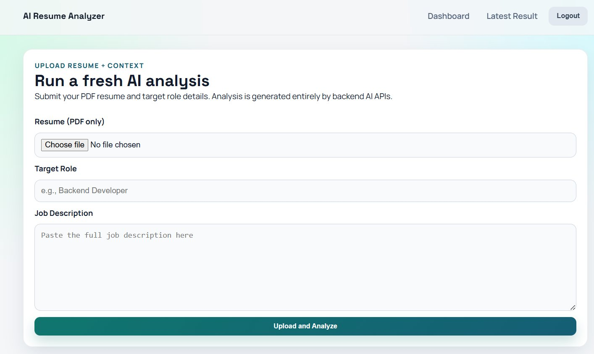
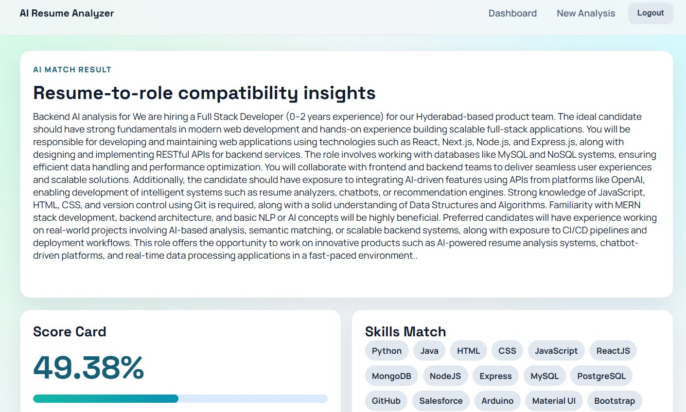
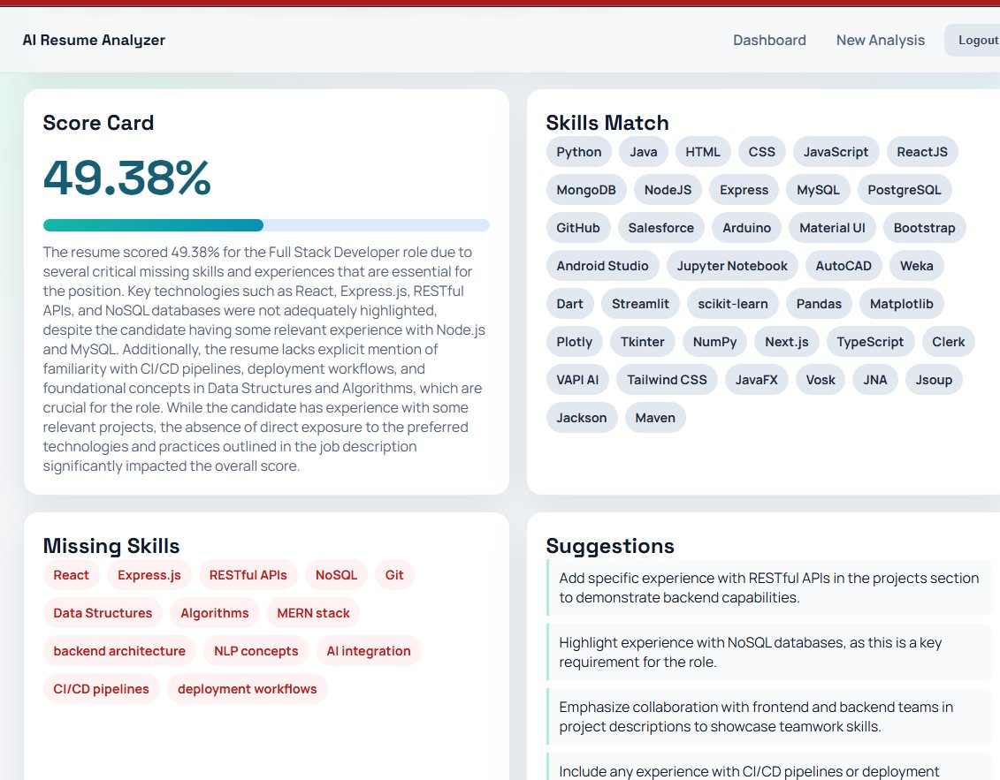
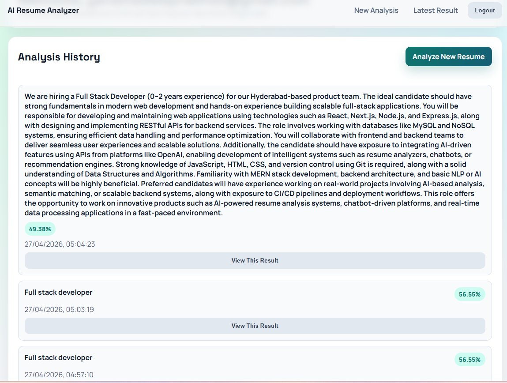

# 🧠 AI Resume Analyzer


> **Go beyond keyword matching.** An AI-powered full-stack resume analyzer that uses OpenAI embeddings and LLM analysis to semantically score your resume against any job description — and tells you exactly how to improve it.

---

## 📸 Screenshots

### 🔐 Login & Register


### 📄 Upload Resume + Job Description


### 🎯 AI Match Score + Skills Match


### 🔍 Full Analysis — Missing Skills & Suggestions


### 📊 Analysis History Dashboard


---

## ✨ Features

- 🔐 **JWT Authentication** — Secure register/login with bcrypt password hashing
- 📄 **PDF Resume Parsing** — Extracts structured text from uploaded PDF resumes with AI-powered fallback for complex layouts
- 🧠 **Semantic Matching** — Uses `text-embedding-3-small` + cosine similarity to match meaning, not just keywords
- 🎯 **ATS Score** — Generates a percentage compatibility score between resume and job description
- 🔍 **Skill Gap Detection** — Identifies missing skills using embedding-based semantic comparison (threshold: 0.82)
- 💡 **AI Suggestions** — `gpt-4o-mini` generates specific, actionable improvement recommendations
- ✏️ **Bullet Rewriter** — Rewrites weak resume bullets into stronger, ATS-friendly versions
- 📊 **Analysis Dashboard** — Full history of all past analyses per user account

---

## 🏗️ Architecture

```
┌─────────────────────────────────────────────────────────┐
│                  Frontend (HTML/CSS/JS)                  │
│     index.html → upload.html → result.html              │
│                  dashboard.html                         │
└──────────────────────────┬──────────────────────────────┘
						   │ REST API
┌──────────────────────────▼──────────────────────────────┐
│                   Express.js Backend                     │
│                                                          │
│  ┌─────────────┐  ┌──────────────┐  ┌───────────────┐  │
│  │   Auth      │  │   Resume     │  │   Analysis    │  │
│  │  Controller │  │  Controller  │  │   Controller  │  │
│  └─────────────┘  └──────────────┘  └───────┬───────┘  │
│                                             │           │
│  ┌──────────────────────────────────────────▼────────┐  │
│  │              Analysis Service                     │  │
│  │  1. Extract skills from resume (gpt-4o-mini JSON) │  │
│  │  2. Extract required skills from JD               │  │
│  │  3. Detect missing skills (embedding similarity)  │  │
│  │  4. Generate match explanation                    │  │
│  │  5. Generate suggestions + improved bullets       │  │
│  └──────────────────────┬────────────────────────────┘  │
│                         │                               │
│  ┌──────────────────────▼────────────────────────────┐  │
│  │              Embedding Service                    │  │
│  │   text-embedding-3-small + cosine similarity      │  │
│  │   SHA-256 hash-based in-memory caching            │  │
│  └──────────────────────┬────────────────────────────┘  │
└─────────────────────────┼───────────────────────────────┘
						  │
		  ┌───────────────▼────────────────┐
		  │         OpenAI API             │
		  │  gpt-4o-mini (chat + JSON)     │
		  │  text-embedding-3-small        │
		  └────────────────────────────────┘
						  │
		  ┌───────────────▼────────────────┐
		  │        NeDB (file-based)       │
		  │  users.db / history.db /       │
		  │  resumes.db                    │
		  └────────────────────────────────┘
```

---

## 🔬 How It Works

### Why Embeddings Instead of Keywords?

Traditional ATS systems match keywords literally. This system matches **meaning**.

| Resume says | JD requires | Keyword match | Embedding match |
|---|---|---|---|
| "built web apps" | "developed web applications" | ❌ 0% | ✅ High |
| "used React" | "ReactJS development" | ❌ 0% | ✅ High |
| "Python scripting" | "Python programming" | ❌ 0% | ✅ High |

### Scoring Pipeline

```
1. PDF Upload
   └── pdf-parse extracts text
   └── If low quality → AI reconstruction fallback

2. Embedding Generation
   └── Resume text → text-embedding-3-small → vector A
   └── Job description → text-embedding-3-small → vector B
   └── SHA-256 hash caching (avoids duplicate API calls)

3. Cosine Similarity Score
   └── score = dot(A,B) / (|A| × |B|)
   └── Clamped to 0–100%

4. Skill Extraction (gpt-4o-mini, JSON mode)
   └── Resume skills list + confidence score
   └── Required skills from JD + confidence score

5. Missing Skill Detection
   └── Each required skill embedded individually
   └── Compared against all resume skill embeddings
   └── Threshold: 0.82 similarity → below = missing

6. Suggestions + Bullet Rewriting (gpt-4o-mini)
   └── Role-specific actionable recommendations
   └── Improved resume bullet points

7. Match Explanation (gpt-4o-mini)
   └── 2–4 sentence specific explanation of score
```

---

## 🛠️ Tech Stack

| Layer | Technology |
|---|---|
| **Frontend** | HTML5, CSS3, Vanilla JavaScript |
| **Backend** | Node.js 18+, Express.js 4.x |
| **AI — LLM** | OpenAI `gpt-4o-mini` (chat completions + JSON mode) |
| **AI — Embeddings** | OpenAI `text-embedding-3-small` |
| **PDF Parsing** | `pdf-parse` with AI fallback |
| **Authentication** | JWT + `bcryptjs` |
| **Database** | NeDB (file-based, no setup required) |
| **File Uploads** | `multer` |

---

## 🚀 Getting Started

### Prerequisites

- Node.js 18+
- OpenAI API key — [get one here](https://platform.openai.com/api-keys)

### Installation

```bash
# 1. Clone the repository
git clone https://github.com/PrabhasDeveloper/ResumeAnalyzer.git
cd ResumeAnalyzer

# 2. Install backend dependencies
cd backend
npm install

# 3. Set up environment variables
cp .env.example .env
# Edit .env and add your OpenAI API key

# 4. Start the backend server
npm run dev

# 5. Open the frontend
# Open index.html in your browser
# Or use Live Server in VS Code
```

### Environment Variables

Create a `.env` file inside the `backend` folder:

```env
OPENAI_API_KEY=your_openai_api_key_here
PORT=3000
JWT_SECRET=your_jwt_secret_here
LLM_MODEL=gpt-4o-mini
EMBEDDING_MODEL=text-embedding-3-small
```

---

## 📁 Project Structure

```
ResumeAnalyzer/
├── index.html              # Login/Register page
├── upload.html             # Resume upload + analysis form
├── result.html             # Analysis results page
├── dashboard.html          # Analysis history dashboard
├── script.js               # Frontend JavaScript
├── style.css               # Global styles
├── screenshots/            # README screenshots
├── .gitignore
├── README.md
│
└── backend/
	├── src/
	│   ├── server.js
	│   ├── app.js
	│   ├── controllers/
	│   │   ├── authController.js
	│   │   ├── resumeController.js
	│   │   ├── analysisController.js
	│   │   └── historyController.js
	│   ├── services/
	│   │   ├── analysisService.js      # Core analysis pipeline
	│   │   ├── embeddingService.js     # Cosine similarity + caching
	│   │   ├── resumeParsingService.js
	│   │   └── suggestionService.js
	│   ├── middleware/
	│   │   ├── authMiddleware.js
	│   │   └── errorMiddleware.js
	│   ├── routes/
	│   │   ├── authRoutes.js
	│   │   ├── resumeRoutes.js
	│   │   ├── analysisRoutes.js
	│   │   └── historyRoutes.js
	│   └── utils/
	│       ├── aiClient.js             # OpenAI client setup
	│       ├── dataStore.js            # NeDB abstraction
	│       └── id.js
	├── data/                           # NeDB files (auto-created)
	├── package.json
	└── .env.example
```

---

## 🔐 Security

- `.env` is gitignored — API keys never committed
- Passwords hashed with `bcryptjs`
- JWT tokens for stateless authentication
- `.env.example` provided for safe onboarding

---

## 🗺️ Roadmap

- [ ] Deploy to Railway / Render
- [ ] Add RAG-based resume improvement suggestions
- [ ] Support DOCX resume format
- [ ] Add skill-by-skill breakdown chart
- [ ] Export analysis as PDF report

---

## 👨‍💻 Author

**Prabhas Yanamadala**  
B.Tech CSE · Malla Reddy University · 2026  
Published Researcher @ ICAEMS 2026

[](https://linkedin.com/in/prabhasyanamadala)
[](https://github.com/PrabhasDeveloper)

---

## 📄 License

MIT License — feel free to use, fork, and build on this project.

---

⭐ **If this project helped you, please give it a star!** It helps others discover it.
